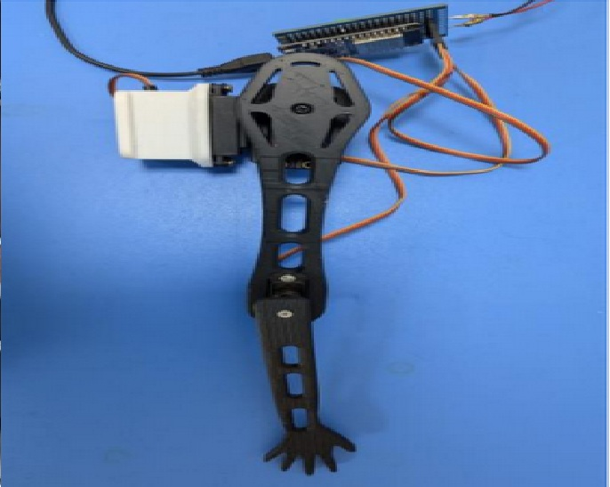
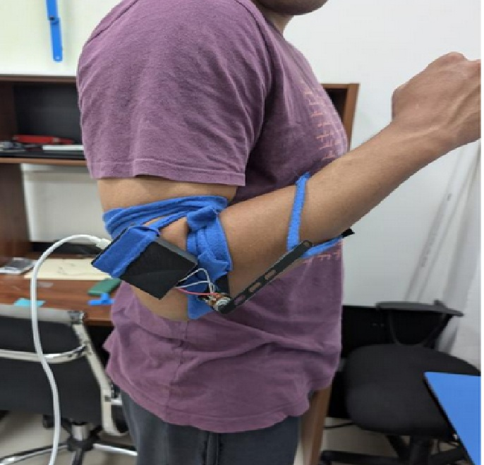

# ESP32 Rehabilitation Arm Twin

Distributed embedded systems prototype for a rehabilitation robotic arm and real-time digital twin. The system uses two ESP32 boards communicating through ESP-NOW: one wearable sensor node captures human arm motion, and one actuator node reproduces that motion on a servo-driven robotic arm.

This repository is organized as an academic and engineering R&D project focused on embedded firmware, real-time task design, wireless communication, sensor calibration, and rehabilitation technology prototyping.

## Repository Description

ESP32-based rehabilitation robotic arm and digital twin prototype using FreeRTOS, MPU6050 IMU sensing, ADC potentiometer feedback, ESP-NOW wireless communication, and PWM servo control.

## Project Overview

The project implements a distributed control system for replicating upper-limb movements in real time. A wearable ESP32 sensor node measures arm orientation with an MPU6050 IMU and elbow motion with an ADC potentiometer. The node processes the sensor readings, converts them into servo duty-cycle commands, and sends them wirelessly to a second ESP32 mounted on a robotic arm.

The robotic arm node receives the command packet and drives three servos representing shoulder and elbow motion. The prototype demonstrates the core firmware architecture needed for a low-cost rehabilitation training, motion mirroring, and digital twin platform.

## Features

- Dual-ESP32 distributed embedded architecture.
- FreeRTOS task scheduling for acquisition, processing, communication, actuation, and monitoring.
- MPU6050 IMU acquisition through I2C.
- ADC-based potentiometer reading for elbow position.
- Complementary filtering for smoother pitch and roll estimation.
- ESP-NOW point-to-point wireless transmission.
- PWM servo actuation using the ESP32 LEDC peripheral.
- Local actuator safety fallback when communication is lost.
- Calibration constants for motion limits, potentiometer range, axis inversion, and filter response.
- Serial monitoring for debugging, calibration, and packet-rate observation.

## System Architecture

```text
Wearable Sensor Node (Master ESP32)
  MPU6050 IMU + ADC Potentiometer
             |
             | Acquisition + filtering + duty-cycle mapping
             v
        ESP-NOW packet
             |
             v
Robotic Arm Node (Slave ESP32)
  ESP-NOW receiver + PWM servo output
             |
             v
Servo-driven robotic arm movement
```

The firmware is split into two roles:

- **Master firmware:** reads the sensors, estimates motion, maps values into servo duty cycles, and transmits the command packet.
- **Slave firmware:** receives servo duty cycles, validates packet size, applies PWM output, and moves to a center fallback position if packets stop arriving.

## Hardware Used

- 2x ESP32 development boards.
- MPU6050 / MPU6000 inertial measurement unit.
- 10 kOhm potentiometer connected to ADC input.
- 2x MG996R servos for shoulder motion.
- 1x MG90S servo for elbow motion.
- Robotic arm structure.
- Wearable support for the sensor system.
- External power supply for servos.
- Jumper wires, mounting hardware, and common ground connection.

## FreeRTOS Task Architecture

### Master Sensor Node

| Task | Period | Priority | Purpose |
| --- | ---: | ---: | --- |
| `Acquisition` | 20 ms | 4 | Reads MPU acceleration registers and potentiometer ADC value. |
| `Processing` | 20 ms | 3 | Computes pitch/roll, applies filtering, maps motion to servo duty cycles. |
| `ESP_NOW_TX` | 20 ms | 2 | Sends the 12-byte command packet to the actuator node. |
| `Monitor` | 500 ms | 1 | Prints sensor, filter, duty-cycle, and transmission status. |

### Slave Actuator Node

| Task | Period | Priority | Purpose |
| --- | ---: | ---: | --- |
| `Servo_Output` | 20 ms | 3 | Applies received duty cycles to the LEDC PWM channels. |
| `Monitor` | 500 ms | 1 | Prints link status, packet rate, and received duty-cycle values. |

The task priorities follow the prototype report: time-sensitive sensing and actuation run at higher priority, while serial monitoring remains low priority because it is diagnostic rather than control-critical.

## ESP-NOW Communication

ESP-NOW is used for low-latency point-to-point communication between both ESP32 boards without requiring a Wi-Fi router. The master registers the slave station MAC address as a peer and sends a compact command packet:

```c
typedef struct {
    uint32_t duty_hombro_h;
    uint32_t duty_hombro_v;
    uint32_t duty_codo;
} paquete_servos_t;
```

The packet is 12 bytes and contains already-calculated PWM duty cycles. This design keeps the slave firmware simple: it only validates the packet size, limits duty values, and updates the servos.

Before running the full system, flash the slave firmware first and copy the printed MAC address into `MAC_ESCLAVO` in the master firmware.

## Calibration Process

Calibration is handled through constants at the top of the master and slave firmware files.

Recommended procedure:

1. Flash the slave firmware and confirm the three servos move to their center fallback position.
2. Record the slave ESP32 station MAC address from the serial monitor.
3. Paste the MAC address into `MAC_ESCLAVO` in the master firmware.
4. Flash the master firmware and monitor raw pitch, roll, ADC, duty-cycle, and transmission status.
5. Adjust `POT_MIN` and `POT_MAX` so the potentiometer range matches the physical elbow linkage.
6. Adjust `HOMBRO_H_ANGULO_MIN`, `HOMBRO_H_ANGULO_MAX`, `HOMBRO_V_ANGULO_MIN`, and `HOMBRO_V_ANGULO_MAX` to match safe shoulder motion.
7. Tune `ALFA_FILTRO` to balance responsiveness and noise reduction.
8. Use `INVERTIR_HOMBRO_H`, `INVERTIR_HOMBRO_V`, and `INVERTIR_CODO` if a joint moves in the opposite direction.
9. Confirm servo duty limits before expanding the mechanical range.

## Current Limitations

- The prototype maps sensor values directly to servo duty cycles and does not yet include closed-loop position feedback on the robotic arm.
- IMU orientation is estimated from accelerometer-based pitch and roll, so dynamic movements may introduce transient error.
- Servo motion range requires manual calibration for each mechanical configuration.
- ESP-NOW communication is currently unencrypted to reduce complexity and latency.
- The actuator safety behavior is a center fallback position, not a medically validated safe state.
- The wearable mounting method affects measurement repeatability.
- The code uses shared global variables between tasks; production firmware should use stronger synchronization patterns where required.

## Results

The implemented prototype demonstrates:

- Real-time wireless command transmission between two ESP32 boards.
- Functional separation between sensor processing and servo actuation.
- Motion replication from a wearable sensing setup to a robotic arm structure.
- Stable periodic firmware operation using FreeRTOS tasks.
- Practical calibration workflow for ADC limits, IMU angle limits, axis direction, and servo ranges.

The results support the feasibility of a low-cost educational rehabilitation arm twin, while leaving space for further validation, mechanical refinement, and control-system improvements.

## Images

### Robotic Arm Actuator Node



### Wearable Sensor System



## Videos

Add demonstration videos here:

- System startup and calibration.
- Real-time arm movement replication.
- Communication-loss fallback behavior.

## Diagrams

Add architecture, wiring, timing, and control diagrams here:

- ESP32 master/slave block diagram.
- Wiring diagram for MPU6050, potentiometer, and servos.
- FreeRTOS task timing diagram.
- ESP-NOW packet flow.

## Future Experiments

- Compare accelerometer-only angle estimation against sensor fusion using gyroscope integration.
- Add servo feedback or external encoders for closed-loop control.
- Measure packet latency and jitter under different distances and environments.
- Evaluate different filtering constants for slow rehabilitation movements.
- Test wearable mounting repeatability across multiple users.
- Add logging for rehabilitation session analysis.

## Future Improvements

- Add proper ESP-IDF project scaffolds for master and slave firmware.
- Use queues or double buffering between FreeRTOS tasks.
- Add watchdog handling and error recovery for I2C, ADC, and ESP-NOW failures.
- Add configurable calibration stored in NVS.
- Add packet sequence numbers and timestamps.
- Add optional ESP-NOW encryption.
- Add a desktop or web visualization layer for the digital twin.
- Improve mechanical design for safer and smoother rehabilitation movement.
- Add validation tests with known angle references.

## Technologies Used

- ESP32
- ESP-IDF
- FreeRTOS
- C
- ESP-NOW
- I2C
- ADC
- PWM / LEDC
- MPU6050 / MPU6000
- Servo motor control
- Embedded systems prototyping
- Rehabilitation engineering

## Repository Structure

```text
esp32-rehabilitation-arm-twin/
├── README.md
├── LICENSE
├── .gitignore
├── docs/
│   ├── README.md
│   └── technical_report.pdf
├── firmware/
│   ├── master/
│   │   ├── README.md
│   │   └── esp32_master_firmware.c
│   └── slave/
│       ├── README.md
│       └── esp32_slave_firmware.c
├── hardware/
│   └── README.md
├── images/
│   ├── robotic_arm.jpg
│   └── wearable_sensor_system.jpg
└── simulation/
    └── README.md
```

## Firmware File Placement

- `firmware/master/esp32_master_firmware.c`: wearable sensor node. Reads MPU6050 and potentiometer, processes motion, and transmits servo commands.
- `firmware/slave/esp32_slave_firmware.c`: robotic arm actuator node. Receives servo commands and drives PWM outputs.
- `docs/technical_report.pdf`: original project report and technical reference.
- `images/robotic_arm.jpg`: robotic arm hardware image.
- `images/wearable_sensor_system.jpg`: wearable sensing setup image.
- `hardware/`: wiring notes, bill of materials, pinout tables, and future CAD/mechanical files.
- `simulation/`: future digital twin, visualization, or control simulation work.

## How to Compile and Run with ESP-IDF

This repository currently stores the firmware source files in organized role-based folders. Each firmware file can be used as the `main` source file of a separate ESP-IDF project.

### Prerequisites

- ESP-IDF installed and configured.
- Two ESP32 development boards.
- USB cables for programming and serial monitoring.
- Correct wiring for the MPU6050, potentiometer, and servos.

### Suggested Build Workflow

Create two ESP-IDF projects, one for the master and one for the slave:

```bash
idf.py create-project esp32_arm_master
idf.py create-project esp32_arm_slave
```

For the master project:

1. Copy `firmware/master/esp32_master_firmware.c` into the ESP-IDF project's `main/` directory.
2. Rename it to `main.c` or update `main/CMakeLists.txt` to compile `esp32_master_firmware.c`.
3. Build and flash:

```bash
idf.py set-target esp32
idf.py build
idf.py -p <MASTER_PORT> flash monitor
```

For the slave project:

1. Copy `firmware/slave/esp32_slave_firmware.c` into the ESP-IDF project's `main/` directory.
2. Rename it to `main.c` or update `main/CMakeLists.txt` to compile `esp32_slave_firmware.c`.
3. Build and flash:

```bash
idf.py set-target esp32
idf.py build
idf.py -p <SLAVE_PORT> flash monitor
```

### Startup Order

1. Flash and run the slave firmware first.
2. Copy the slave MAC address printed in the serial monitor.
3. Paste it into `MAC_ESCLAVO` in the master firmware.
4. Flash and run the master firmware.
5. Confirm the slave monitor shows received packets and duty-cycle updates.

## Research and Rehabilitation Applications

This prototype is not a clinical device. It is an engineering research platform for exploring:

- Low-cost rehabilitation robotics.
- Wearable motion capture for upper-limb movement.
- Real-time digital twin behavior in embedded systems.
- Distributed firmware architectures for assistive devices.
- Wireless control loops using ESP-NOW.
- Embedded sensing and actuation for education and prototyping.

Potential research extensions include repeatability studies, patient-specific calibration, range-of-motion tracking, therapist-facing visualization, and closed-loop control validation.

## Documentation

The original project report is available at:

[docs/technical_report.pdf](docs/technical_report.pdf)

## License

MIT License is recommended for this repository. See [LICENSE](LICENSE).
